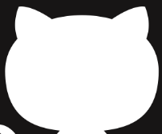

# ImageDiffApply
This is a small demo application that takes a small input image and target larger image. The application scales image-1 and applies the difference between image1 and image2.

1. Image-1 Small input

2. Image-2 Target image

3. Image-3 Diff-mask between the images

4. Image-4 - image after applying the diff.

